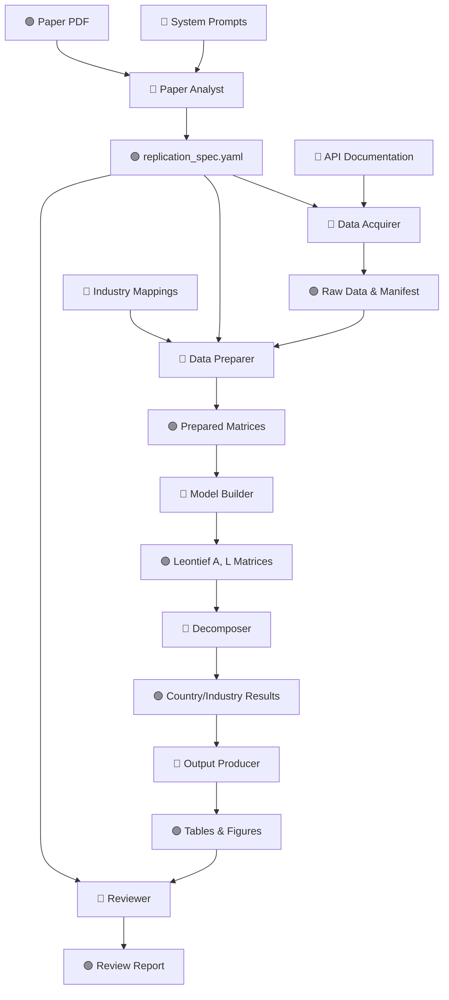

# IO Replicator — Agentic Workflow

This document illustrates the flow of data and the interaction between agents in the IO Replicator pipeline.

### 🔑 Key
- 🔵 **General Inputs**: Static configuration, system prompts, and global industry standards.
- 🟢 **Project Specific Input**: Data unique to the current paper (PDF, Spec, Raw Data).
- 🤖 **AI Agent Tool**: LLM-powered nodes and specialized deterministic tools.

---

### 🗺️ Visual Workflow

---

### 📋 Agent Descriptions

| Agent / Tool | Key | Description | Output |
| :--- | :--- | :--- | :--- |
| **Paper Analyst** | 🤖 | Uses Claude Opus to parse academic PDFs and extract methodology. | `replication_spec.yaml` |
| **Data Acquirer** | 🤖 | GPT-4o-mini writes and executes Python scripts to fetch data from APIs. | `data/raw/` |
| **Data Preparer** | 🤖 | Claude Sonnet parses raw CSVs into fixed-dimension matrices (N=1792). | `data/prepared/` |
| **Model Builder** | 🤖 | (Deterministic) Computes technical coefficients and Leontief Inverse. | `data/model/` |
| **Decomposer** | 🤖 | (Deterministic) Splits results into domestic and spillover effects. | `data/decomposition/` |
| **Output Producer**| 🤖 | GPT-4o-mini generates Matplotlib code for charts and tables. | `outputs/` |
| **Reviewer** | 🤖 | Claude Sonnet compares run results against the paper's benchmarks. | `review_report.md` |

---

### 📥 Input Categories

| Category | Key | Examples |
| :--- | :--- | :--- |
| **General Inputs** | 🔵 | `config.yaml`, System Prompts, Eurostat API schemas. |
| **Project Specific**| 🟢 | The specific paper PDF, the generated YAML spec, downloaded CSVs. |
| **AI Agent Tool** | 🤖 | The LangGraph nodes (LLM-based or Python-based math tools). |
