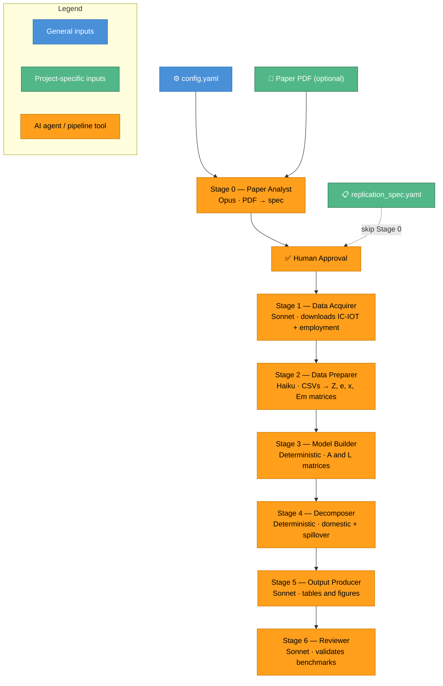

# IO Replicator

Generic multi-agent system for replicating Input-Output economics papers.

Given a paper PDF (or a hand-crafted spec), it runs a 7-stage pipeline: data acquisition → Leontief model → decomposition → outputs → review. Paper-specific knowledge lives entirely in a `replication_spec.yaml`; the agents are generic IO analysis tools. The same pipeline can replicate any IO paper — not just FIGARO.

## Pipeline Workflow



## Pipeline overview

| Stage | Type | Model | Role | Output |
|-------|------|-------|------|--------|
| 0 — Paper Analyst | Single LLM call | Claude Opus | PDF → `replication_spec.yaml` | `replication_spec.yaml` |
| 1 — Data Acquirer | Agentic loop | Claude Sonnet | Download raw IO tables + satellite data | `data/raw/` |
| 2 — Data Preparer | Single-shot codegen | Claude Haiku | Parse → Z, e, x, Em matrices | `data/prepared/` |
| 3 — Model Builder | **Deterministic** | — | A, L, d, employment content | `data/model/` |
| 4 — Decomposer | **Deterministic** | — | Domestic/spillover, direct/indirect | `data/decomposition/` |
| 5 — Output Producer | Agentic loop | Claude Sonnet | Tables + figures from spec | `outputs/` |
| 6 — Reviewer | Deterministic + single LLM call | Claude Sonnet | Benchmark validation | `outputs/review_report.md` |

**Typical cost per full run:** ~$2–4. Stage 0 (Opus) ~$1, Stage 1 (Sonnet agentic) ~$1, Stage 2 (Haiku single-shot) ~$0.10.

## Setup

```bash
git clone https://github.com/ilan5410/io-replicate
cd io-replicate
pip install -e .

export ANTHROPIC_API_KEY=sk-ant-...   # required for all stages
export OPENAI_API_KEY=sk-...          # optional — only needed if routing stages to GPT models
```

**Note on Python version:** All stages default to Anthropic. If you want to use `openai/gpt-4o-mini` for stages 1 and 5 (cheaper), use Python 3.10–3.12 — `langchain-openai` has serialization issues on Python 3.14+.

Dependencies: `langchain-anthropic`, `langchain-openai`, `langgraph`, `numpy`, `pandas`, `pyyaml`, `click`, `rich`. All pinned in `requirements.txt`.

## Running the pipeline

### Full run (all stages)

```bash
# With the hand-crafted FIGARO spec (skips Paper Analyst — no PDF needed)
io-replicate run --spec specs/figaro_2019/replication_spec.yaml --auto-approve

# With a paper PDF (runs Paper Analyst first, then prompts for spec approval)
io-replicate run --paper path/to/paper.pdf
```

The run directory is printed at startup (e.g. `runs/20260401_120000`). All intermediate outputs are saved there.

### Stages 1–2 only (data download + preparation)

There is no `--stop-stage` flag — the full pipeline runs sequentially. Stages 1–2 are the expensive ones (~30 min + ~3 min). Stages 3–6 are fast (< 2 min total).

```bash
io-replicate run --spec specs/figaro_2019/replication_spec.yaml --auto-approve
# note the run ID: e.g.  Run directory: runs/20260401_120000
```

Once data is downloaded you can re-run stages 3–6 instantly without any LLM cost:

```bash
python run_deterministic.py \
  --spec specs/figaro_2019/replication_spec.yaml \
  --run-dir runs/20260401_120000 \
  --start-stage 3
```

### Resume from a specific stage

```bash
# Resume an existing run from stage 2 onwards (data already downloaded)
io-replicate run --spec specs/figaro_2019/replication_spec.yaml \
                 --start-stage 2 --auto-approve

# Run only the reviewer on an existing run
io-replicate run --spec specs/figaro_2019/replication_spec.yaml \
                 --only reviewer --auto-approve
```

### Validate a spec without running the pipeline

```bash
io-replicate validate --spec specs/figaro_2019/replication_spec.yaml
```

## Included spec: FIGARO 2019

`specs/figaro_2019/replication_spec.yaml` is the hand-crafted spec for:

> Rémond-Tiedrez, Valderas-Jaramillo, Amores & Rueda-Cantuche (2019),
> *The employment content of EU exports: an application of FIGARO tables*,
> EURONA, Issue 1, pp. 59–78.

**Current results** (2010, product-by-product proxy):

| Benchmark | Paper | Pipeline | Deviation |
|-----------|-------|----------|-----------|
| EU-28 export employment | 25,597 THS | 24,946 THS | −2.5% ✓ PASS |
| EU-28 total employment | 225,677 THS | ~225,000 THS | ~0.3% ✓ PASS |
| Luxembourg spillover share | 46.7% | ~47% | ~0.6% ✓ PASS |

Remaining deviations are explained by product-vs-industry table type and missing confidential LU/MT employment data — both documented as known limitations in the spec.

## Architecture

```
specs/figaro_2019/replication_spec.yaml  ← paper knowledge (geography, benchmarks, sources…)
         │
         ▼
agents/orchestrator.py  ← LangGraph StateGraph
         │
    ┌────┴────┐
    │  nodes/ │   paper_analyst · data_acquirer · data_preparer
    │         │   model_builder · decomposer · output_producer · reviewer
    └────┬────┘
         │
    agents/
      llm.py              ← provider routing + caching + temperature config
      agent_runner.py     ← shared tool-calling loop (message trimming, token tracking)
      message_utils.py    ← sliding-window trim, keeps system+first HumanMessage
      token_tracker.py    ← per-stage cost tracking + circuit breaker
      validators/
        spec_validator.py      ← jsonschema validation of replication_spec
        prep_validator.py      ← numpy/pandas checks on prepared matrices
        benchmark_validator.py ← deterministic benchmark comparison from spec sources
      tools/
        execute_python.py  ← write + run scripts; strips API keys from env; cwd=run_dir
        file_tools.py      ← read (5K cap, matrix blocklist) + write (path-restricted)
```

### Replication spec

The spec is the single shared context between all agents. It carries:
- **Paper metadata** — title, year, reference year
- **Geography** — which countries are inside/outside the Leontief system
- **Classification** — industry list, aggregation schemes
- **Data sources** — Eurostat codes, API quirks, table variants
- **Methodology** — export definition, model variant
- **Outputs** — every table and figure to produce
- **Benchmarks** — expected values + `source` descriptors for deterministic checking
- **Limitations** — known methodological differences from the paper

To replicate a new paper: write a `replication_spec.yaml` (or run `io-replicate run --paper paper.pdf` to generate one automatically).

### Benchmark sources

Each benchmark entry in the spec can carry an optional `source` descriptor:

```yaml
benchmarks:
  values:
    - name: "Total export-supported employment"
      expected: 25597
      unit: thousands
      source: {file: country_decomposition, op: sum_column, column: total_by_country_THS}
    - name: "Germany domestic share"
      expected: 5700
      unit: thousands
      source: {file: country_decomposition, op: lookup, filter: {country: DE}, column: domestic_effect_THS}
```

Benchmarks with a `source` are checked deterministically (no LLM, free, reproducible). Benchmarks without one are passed to the reviewer LLM for narrative treatment. Supported ops: `sum_column`, `lookup`. Supported files: `country_decomposition`, `industry_table4`, `industry_figure3`.

## Running tests

```bash
.venv/bin/python -m pytest tests/ -v
# 45 tests — model math, decomposition identities, file safety, message trimming, spec validation
```

## Cost controls

- **Circuit breaker**: set `max_cost_per_stage` in `config.yaml` (default $2.00). The pipeline raises if an agentic stage exceeds this.
- **Message trimming**: sliding window keeps the last 40 messages; never drops the system prompt or first user message.
- **Read caps**: `read_file` is capped at 5,000 chars; large matrix files (Z_EU, L_EU, A_EU, .npy) are blocked entirely.
- **Temperature**: set per-agent in `config.yaml` under `llm.temperatures` (reviewer defaults to 0.0 for reproducibility).
- **Single-shot stages**: Stage 2 (Data Preparer) uses one LLM call to generate the parse script rather than an agentic loop, reducing cost from ~$3 to ~$0.10.

## Configuration

```yaml
# config.yaml
llm:
  routing:
    paper_analyst:  anthropic/claude-opus-4-6
    data_acquirer:  anthropic/claude-sonnet-4-6
    data_preparer:  anthropic/claude-haiku-4-5-20251001
    output_producer: anthropic/claude-sonnet-4-6
    reviewer:       anthropic/claude-sonnet-4-6
  temperatures:
    reviewer: 0.0
    paper_analyst: 0.2
  paper_analyst_max_tokens: 16000  # raise if spec is truncated

pipeline:
  max_retries: 3
  max_cost_per_stage: 2.0   # USD — circuit breaker
  checkpoint_db: runs/checkpoints.sqlite
  runs_dir: runs/
```
